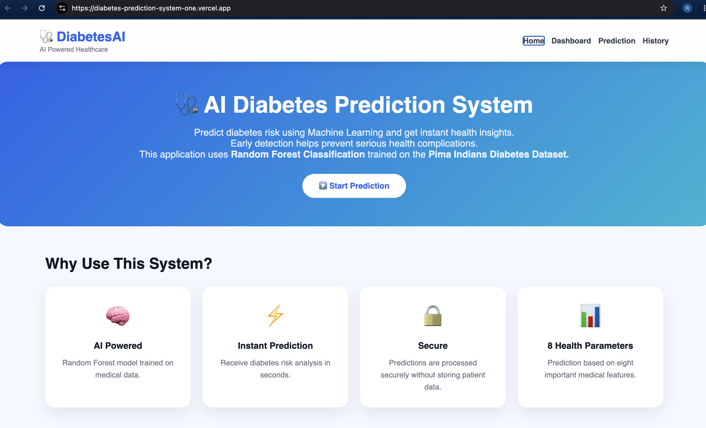
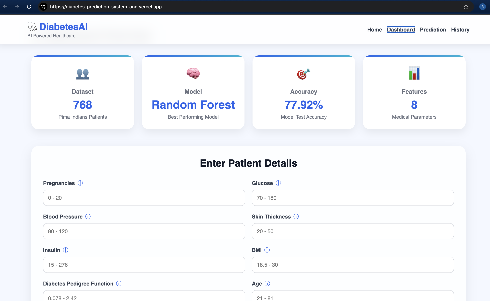
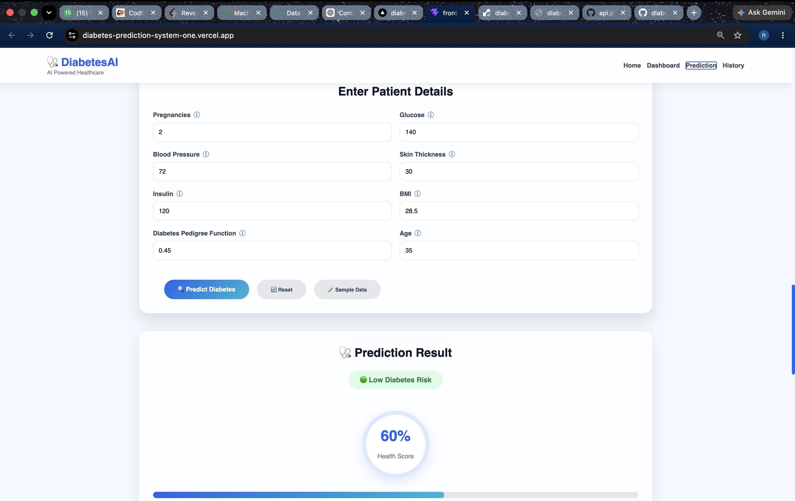
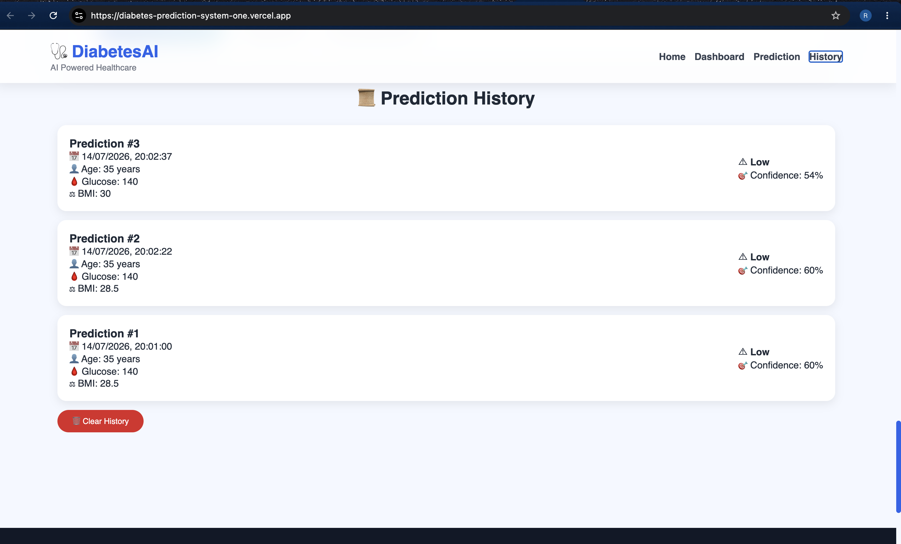
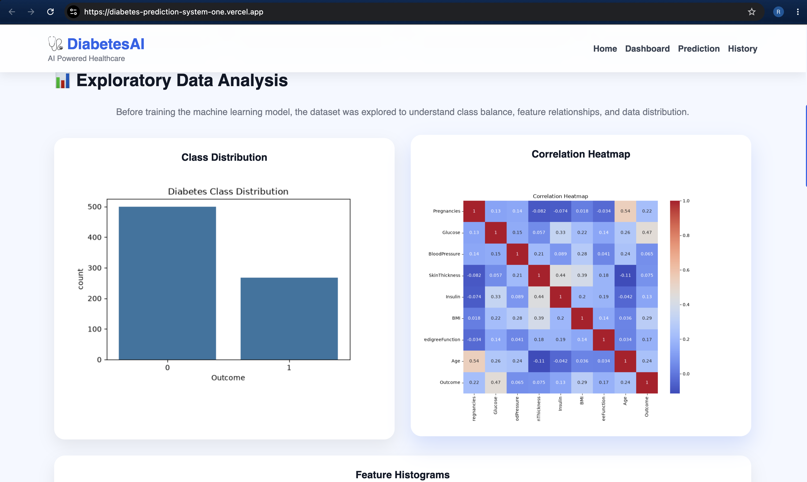

DiabetesAI 🩺

AI-Powered Diabetes Prediction System using Machine Learning

🔗 Live Demo: https://diabetes-prediction-system-one.vercel.app/

🔗 Backend API: https://diabetes-prediction-system-w7pb.onrender.com

📂 GitHub Repository: https://github.com/riasingh1234/diabetes-prediction-system

Overview

DiabetesAI is a full-stack web application that predicts diabetes risk using a Random Forest Machine Learning model trained on the Pima Indians Diabetes Dataset.

The application provides:

🧠 AI-powered prediction
📊 Interactive dashboard
📈 Exploratory Data Analysis
📜 Prediction history
💡 Personalized health recommendations
✅ Input validation
📱 Responsive UI
Tech Stack
Frontend	Backend	Machine Learning
React	Flask	Random Forest
Vite	Flask-CORS	Scikit-Learn
Axios	Joblib	Pandas
CSS3	NumPy	Matplotlib
Features
AI-powered diabetes prediction
Dashboard with dataset statistics
Patient prediction form
Prediction confidence score
Health recommendations
Prediction history
EDA visualizations
Responsive design
Screenshots
Home

Dashboard

Prediction

History

EDA

Machine Learning Workflow
Dataset
    │
    ▼
EDA
    │
    ▼
Data Cleaning
    │
    ▼
Feature Scaling
    │
    ▼
Train/Test Split
    │
    ▼
Train Multiple Models
    │
    ▼
Random Forest Selected
    │
    ▼
Flask API
    │
    ▼
React Frontend
Installation
Clone the repository
git clone https://github.com/riasingh1234/diabetes-prediction-system.git

cd diabetes-prediction-system
Backend
cd backend

pip install -r requirements.txt

python app.py
Frontend
cd frontend

npm install

npm run dev
Project Structure
diabetes-prediction-system/
│
├── backend/
│   ├── app.py
│   ├── model.pkl
│   ├── scaler.pkl
│   ├── model_metadata.json
│
├── frontend/
│   ├── public/
│   ├── src/
│   └── package.json
│
├── data/
│   └── diabetes.csv
│
├── outputs/
│
├── scripts/
│   └── train_model.py
│
└── README.md
Dataset
Dataset: Pima Indians Diabetes Dataset
Patients: 768
Medical Features: 8
Target: Diabetes Outcome
Author

Ria Singh

License

MIT License
